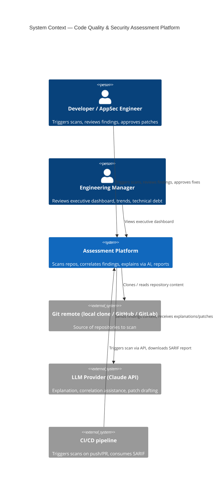
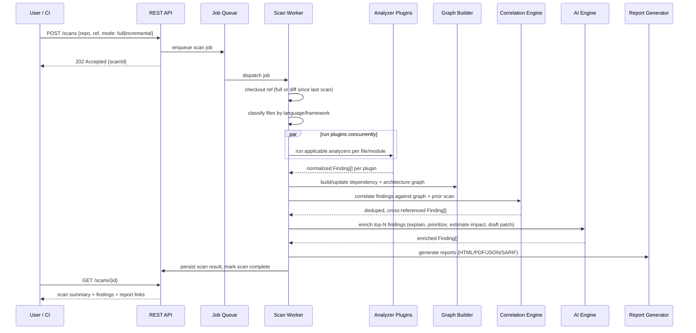

# Architecture Overview (Phase 1)

## Vision

An orchestration + correlation + AI-explanation layer over best-of-breed static
analysis engines, producing findings that are prioritized by actual exploitability
and business impact rather than raw rule-hit count — closing the gap between
"318 Semgrep findings" and "80 findings a human pentester actually cared about."

## Non-goals for v1

These are explicitly out of scope until the core loop (scan → correlate →
explain → report) is validated on real repositories:

- Multi-tenant isolation, billing, org management UI
- GitHub/GitLab App (OAuth, webhooks, PR status checks)
- Automatic PR creation (AI drafts patches; a human triggers PR creation)
- Support for languages/frameworks beyond the initial JS/TS/Node/React/Docker/CI set

See `docs/adr/0003-defer-multitenancy-and-live-vcs-integration.md` and
`docs/adr/0004-human-in-the-loop-for-ai-patches-and-prs.md`.

## Guiding principles

1. **Orchestrate, don't reimplement.** Wrap proven OSS engines behind a common
   plugin interface; build custom logic only where no adequate tool exists
   (cross-file correlation, reachability, business-impact scoring, AI explanation).
2. **Plugins are the extension point**, not forks of the core engine. Adding a
   language/framework means adding a plugin package, not touching orchestration.
3. **Findings are normalized immediately.** Every analyzer plugin emits the same
   `Finding` shape (severity, confidence, CWE, OWASP mapping, affected files,
   evidence) so correlation/dedup/AI enrichment operate on one model, not N.
4. **Incremental scanning is first-class**, not bolted on. A scan is always
   "diff since last scan of this ref" when a prior scan exists.
5. **Writes to external systems require explicit human action.** The platform
   never pushes commits, opens PRs, or comments on issues without a user
   clicking "do this."

## System context



## Logical containers

```mermaid
flowchart TB
  subgraph Client
    web[Web Dashboard\nReact + TypeScript]
  end

  subgraph API_Layer["API Layer"]
    api[REST API\nNestJS]
  end

  subgraph Async["Background Processing"]
    queue[(Job Queue\nBullMQ + Redis)]
    worker[Scan Worker]
  end

  subgraph Core["Scan Core"]
    orchestrator[Scan Orchestrator]
    plugins[Analyzer Plugins\nSemgrep / ESLint / jscpd /\nmadge / gitleaks / OSV / checkov]
    graph[Dependency & Architecture\nGraph Builder]
    correlate[Correlation & Dedup Engine]
  end

  subgraph AIEngine["AI Analysis Engine"]
    ai[LLM Provider Abstraction]
  end

  subgraph Reporting
    report[Report Generator\nHTML / PDF / JSON / SARIF]
  end

  subgraph Storage
    pg[(PostgreSQL\nfindings, scans, repos, orgs)]
    blob[(Object Storage\nscan artifacts, reports)]
  end

  web -->|REST| api
  api --> pg
  api --> queue
  queue --> worker
  worker --> orchestrator
  orchestrator --> plugins
  plugins --> graph
  graph --> correlate
  correlate --> ai
  ai --> report
  correlate --> pg
  report --> blob
  report --> pg
  api --> blob
```

## Scan lifecycle



## Key architectural decisions

| Decision                                                                               | ADR                                                                      |
| -------------------------------------------------------------------------------------- | ------------------------------------------------------------------------ |
| Orchestrate existing engines instead of custom parsers per language                    | [0001](../adr/0001-orchestrate-existing-engines.md)                      |
| TypeScript monorepo (pnpm + Turborepo)                                                 | [0002](../adr/0002-typescript-monorepo.md)                               |
| Defer multi-tenancy hardening and live VCS App integration                             | [0003](../adr/0003-defer-multitenancy-and-live-vcs-integration.md)       |
| Human-in-the-loop for AI-generated patches and PRs                                     | [0004](../adr/0004-human-in-the-loop-for-ai-patches-and-prs.md)          |
| REST API framework: NestJS on Express adapter                                          | [0005](../adr/0005-api-framework-nestjs.md)                              |
| Job queue: BullMQ + Redis                                                              | [0006](../adr/0006-job-queue-bullmq-redis.md)                            |
| ORM: Prisma, with a parameterized-raw-SQL guardrail                                    | [0007](../adr/0007-orm-prisma.md)                                        |
| Frontend stack: React Router, TanStack Query, Tailwind, React Flow, Recharts           | [0008](../adr/0008-frontend-stack.md)                                    |
| DB schema: persistent Finding entity, denormalized org_id, graph stays out of Postgres | [0009](../adr/0009-database-schema-design.md)                            |
| Clean Architecture layering, proven with a real create/get-scan vertical slice         | [0010](../adr/0010-clean-architecture-layering.md)                       |
| Plugin runtime: worker-thread isolation with enforced timeouts                         | [0011](../adr/0011-plugin-runtime-isolation.md)                          |
| Correlation engine: fingerprint dedup now, graph-based correlation in Phase 8          | [0012](../adr/0012-correlation-engine-scope.md)                          |
| AI engine: structured prompt/response contracts and a hard pre-call cost guard         | [0013](../adr/0013-ai-engine-contracts-and-cost-guard.md)                |
| Auth: API tokens only, dashboard reuses the same token via httpOnly cookie             | [0014](../adr/0014-auth-model.md)                                        |
| Pagination/filtering: offset-based, shared `PaginatedResult<T>` convention             | [0015](../adr/0015-pagination-and-filtering.md)                          |
| CI/CD usage: the existing REST API with a token, no bespoke webhook receiver yet       | [0016](../adr/0016-ci-usage-contract.md)                                 |
| External tool resolution: env var override, then PATH, then a real error               | [0017](../adr/0017-external-tool-resolution.md)                          |
| Scan orchestrator: glob dispatch, per-plugin failure isolation, git-diff incremental   | [0018](../adr/0018-scan-orchestrator-design.md)                          |
| Report generation: object storage port, shared report model, per-format choices        | [0019](../adr/0019-report-generation-and-storage.md)                     |
| Automated enrichment: rule-based, no LLM calls — supersedes ADR-0013's provider design | [0020](../adr/0020-automated-enrichment-no-llm.md)                       |
| Worker wiring: real scan execution, local-checkout requirement, fingerprint upsert     | [0021](../adr/0021-worker-wiring-and-scan-execution.md)                  |
| Email-based login for @curatal.com — interim, no password/verification yet             | [0022](../adr/0022-email-login-curatal-domain.md)                        |
| Scan cancel (real abort), live progress, category selection, target folder picker      | [0023](../adr/0023-scan-cancel-progress-categories-and-target-picker.md) |
| LLM-generated Jest unit tests (Gemini), execution, and reporting                       | [0024](../adr/0024-llm-unit-test-generation.md)                          |

See `docs/architecture/erd.md` for the full entity-relationship diagram.

## Open risks

- **LLM cost/latency at scale.** Sending full-repo context per scan is
  expensive; the correlation engine must pre-filter to the top-N
  highest-signal findings before the AI enrichment step, not send everything.
- **Engine licensing.** Some OSS engines have usage restrictions at
  commercial-SaaS scale (verify Semgrep OSS ruleset vs Pro rules before
  productizing). Flagged for revisit before any paid offering.
- **False-positive fatigue.** Without a real reachability/dataflow model,
  cross-file correlation can still over-trust static findings (see the
  Semgrep-vs-Rudra comparison in the parent repo — several Semgrep clusters
  were downgraded once real architecture/reachability was known). The
  correlation engine should be judged against that comparison as ground truth.

## Phase 1 sign-off criteria

- [x] System context and container diagrams reviewed
- [x] Key decisions captured as ADRs
- [x] User confirms MVP module priority (Security/Secrets/Deps/Quality first)
      and non-goals before Phase 2 (folder structure) begins
