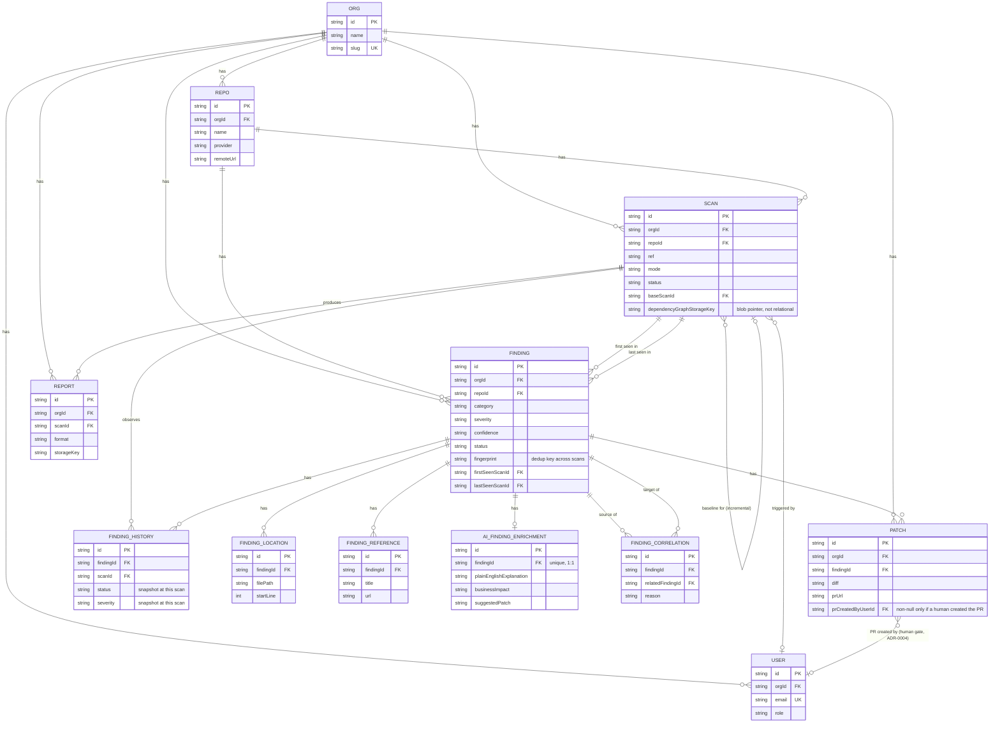

# Entity-Relationship Diagram (Phase 4)

Source of truth is `packages/db/prisma/schema.prisma`; this is a readable
companion to it. See `docs/adr/0009-database-schema-design.md` for why
`Finding` is persistent (not a per-scan row) and why `org_id` is
denormalized onto every tenant-scoped table.

## Verified so far

- `prisma validate` passes.
- `prisma generate` produces a working, typed client (`@cqp/db` builds and
  typechecks against it).
- Migration SQL generated offline (no live DB needed to generate it) and
  committed at `packages/db/prisma/migrations/`.
- **Verified live against a real PostgreSQL 18 server** (2026-07-17): both
  migrations applied cleanly via `prisma migrate deploy` into an isolated
  `cqp` schema inside a dedicated database, kept fully separate from any
  application data. Exercised end-to-end through the real running API, not
  just the migration itself:
  - `POST /repos` → `POST /scans` → `GET /scans/:id` — real rows created
    and fetched, independently confirmed via direct SQL against the same
    tables the API wrote to.
  - `POST /scans` with a nonexistent `repoId` → real `404`, proving the
    Phase 6 tenant/existence check (ADR-0014) holds against live data, not
    just the in-memory fakes.
  - A garbage bearer token → real `401` from the DB-backed
    `ApiTokenGuard` (previously this could only be demonstrated as a `500`
    with no live DB — see BACKLOG.md Epic 6).
  - `docker-compose.yml`'s `cqp`/local-Postgres path is still the intended
    default dev setup; this verification used a separate, already-running
    Postgres instance instead. See `docs/architecture/dev-database.md` for
    how to reconnect to that same setup if needed again.
